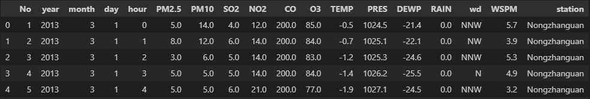

# Meteo Data Mining Project

## **Overview**
This project focuses on leveraging data mining techniques to analyze meteorological (meteo) data. The objective is to extract meaningful insights and patterns from the data that can aid in understanding weather phenomena and predicting future weather conditions.

## **Information About Dataset** :

### Introduction : 
 The **"Meteo12"** dataset contains the following features: ['No', 'year', 'month', 'day', 'hour', 'PM2.5', 'PM10', 'SO2', 'NO2', 'CO', 'O3', 'TEMP', 'PRES', 'DEWP', 'RAIN', 'wd', 'WSPM', 'station'], such that each column has a meaning and this dataset does not contain the Target column.

  That is to say, to apply supervised machine learning algorithms we must first apply an unsupervised algorithm to create a Target column.
 
  These columns provide various measurements and indicators of weather conditions, air quality and atmospheric properties.

  

  ### **the meaning of each column in your weather dataset**:

1. **year**: The year in which the weather data was recorded.
2. **month**: The month in which the weather data was recorded.
3. **day**: The day of the month on which the weather data was recorded.
4. **time**: The time of day the weather data was recorded.
5. **PM2.5**: Particulate matter (PM) with a diameter of 2.5 micrometers or less, which can penetrate deep into the respiratory system and pose health risks when present in high concentrations .
6. **PM10**: Particulate matter (PM) with a diameter of 10 micrometers or less, which can also cause adverse health effects when present in high concentrations.
7. **SO2**: Sulfur dioxide, a gas primarily emitted by the burning of fossil fuels such as coal and oil. It can contribute to respiratory problems and is a precursor to acid rain.
8. **NO2**: Nitrogen dioxide, a reddish-brown gas that forms when nitrogen oxides react with pollutants in the air. This can irritate the airways and worsen respiratory conditions.
9. **CO**: Carbon monoxide, a colorless and odorless gas produced by the incomplete combustion of fuels containing carbon. It can be harmful when inhaled in large quantities, leading to carbon monoxide poisoning.
10. **O3**: Ozone, a gas composed of three oxygen atoms. While ozone in the atmosphere protects us from the sun's ultraviolet rays, ground-level ozone is a pollutant that can cause respiratory problems and exacerbate lung conditions.
11. **TEMP**: Temperature, measure of how hot or cold the air is.
12. **PRES**: Atmospheric pressure, the force exerted by the weight of air molecules above a particular point on the Earth's surface.
13. **DEWP**: Dew point, the temperature at which the air becomes saturated with water vapor and dew begins to form.
14. **RAIN**: Precipitation, amount of rain recorded during the specified period.
15. **WSPM**: Wind speed, the rate at which air moves horizontally past a given point.
16. **wd**: Wind direction, indicating the direction the wind is blowing from. It is usually indicated in cardinal directions (e.g., N for North, S for South, etc.) or in degrees (e.g., 0° for North, 90° for East, etc.).
17. **station**: The name or identifier of the weather station where the data was recorded. This column specifies the location or source of weather observations.

## **Methodology**
1. **Data Preprocessing**: The raw meteo data is preprocessed to handle missing values, outliers, and any noise present in the dataset. This step ensures the data is in a suitable format for analysis.

2. **Feature Engineering**: Relevant features are selected or engineered from the raw data to improve the performance of the models. This step involves domain knowledge and understanding of meteorology to identify key variables.

3. **Clustering (K-Means)**: The K-Means clustering algorithm is applied to the preprocessed data to group similar instances together. This helps in identifying distinct weather patterns and clusters within the dataset.

4. **Target Generation**: Based on the clusters obtained from K-Means, a target column is generated, which represents different weather patterns or conditions. This target column serves as the label for the classification models.

5. **Model Training**: Three classification algorithms - Support Vector Machine (SVM), Classification and Regression Trees (CART), and k-Nearest Neighbors (KNN) - are trained on the preprocessed data with the generated target column.

6. **Model Evaluation**: The trained models are evaluated using appropriate metrics such as accuracy, precision, recall, and F1-score. This step helps in assessing the performance of each model and selecting the best-performing one for deployment.

7. **Deployment**: The chosen model is deployed for real-time or batch prediction of weather patterns based on new incoming data.

## Repository Structure
- **DataMeteo12 Complet.csv**: Contains the raw meteo data
- **1 - KMeans for Meteo12**: Jupyter notebooks detailing the data preprocessing, feature engineering, appling K-Means Model.
- **2 - SVM for Meteo12**: Jupyter notebooks for appling SVM Model.
- **3 - KNN for Meteo12**: Jupyter notebooks for appling KNN Model.
- **4 - CART for Meteo12**: Jupyter notebooks for appling CART Model.
- **Final Report**: Jupyter notebooks contains the final results and decisions.

--- 

Feel free to adjust or expand upon any section to better fit your project's specifics!
